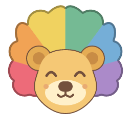

# Zoey the XUI Lion

Zoey is the XUI mascot and application icon.
Her front-facing head has happy closed eyes and six touching, cloud-shaped mane regions above and beside the face.
The mane uses the Enamel colors `#ED6B79`, `#F1A355`, `#F0D260`, `#75BA94`, `#75AED7`, and `#AB8AC9`.
A darker, color-matched outline follows the mane perimeter without gaps or divider lines at the color joins.
The face and ears have a brown outline.
The canonical version uses the rainbow palette.

## Brand assets

- [Editable source SVG](../../../assets/branding/zoey.svg)
- [Canonical SVG](../../../assets/branding/generated/zoey.svg)
- [Windows ICO](../../../assets/branding/generated/zoey.ico)
- [PNG, 256 pixels](../../../assets/branding/generated/zoey-256.png)
- [PNG, 1024 pixels](../../../assets/branding/generated/zoey-1024.png)
- [All generated assets](../../../assets/branding/generated)
- [Local palette preview](../../../assets/branding/generated/index.html)

The SVGs and PNGs have transparent backgrounds.
PNG exports cover 16, 20, 24, 32, 40, 48, 64, 96, 128, 180, 192, 256, 512, and 1024 pixels.
Each ICO contains ten sizes, from 16 through 256 pixels, with 32-bit color and transparency.
The 180-pixel PNG supports touch icons.
The web manifest references the 192-pixel and 512-pixel PNGs.

## Color and status versions

Each single-hue palette changes the mane, face, and feature colors together.
The shape, happy expression, and continuous outline remain the same.
These files are available to application authors.
They do not change framework behavior.

- Rainbow / canonical: [SVG](../../../assets/branding/generated/zoey.svg), [PNG](../../../assets/branding/generated/zoey-256.png), [ICO](../../../assets/branding/generated/zoey.ico)
- Slate / idle: [SVG](../../../assets/branding/generated/zoey-idle.svg), [PNG](../../../assets/branding/generated/zoey-idle-256.png), [ICO](../../../assets/branding/generated/zoey-idle.ico)
- Blue / active: [SVG](../../../assets/branding/generated/zoey-active.svg), [PNG](../../../assets/branding/generated/zoey-active-256.png), [ICO](../../../assets/branding/generated/zoey-active.ico)
- Green / success: [SVG](../../../assets/branding/generated/zoey-success.svg), [PNG](../../../assets/branding/generated/zoey-success-256.png), [ICO](../../../assets/branding/generated/zoey-success.ico)
- Amber / warning: [SVG](../../../assets/branding/generated/zoey-warning.svg), [PNG](../../../assets/branding/generated/zoey-warning-256.png), [ICO](../../../assets/branding/generated/zoey-warning.ico)
- Red / error: [SVG](../../../assets/branding/generated/zoey-error.svg), [PNG](../../../assets/branding/generated/zoey-error-256.png), [ICO](../../../assets/branding/generated/zoey-error.ico)
- Violet / paused: [SVG](../../../assets/branding/generated/zoey-paused.svg), [PNG](../../../assets/branding/generated/zoey-paused-256.png), [ICO](../../../assets/branding/generated/zoey-paused.ico)

Color alone does not communicate status to every reader.
Applications must pair a status color with a label or another accessible indication.
Zoey keeps her happy expression in all palettes.
The status labels describe application state, not emotion.

## Use in XUI

XUI uses the canonical rainbow icon for its samples, Designer, documentation, and VS Code syntax package.
Application authors keep control of their own window icons.
The framework does not apply Zoey as a default to unrelated applications.

The [contributor guide](../../../CONTRIBUTING.md#zoey-brand-assets) describes how to replace the source SVG and regenerate every asset.
